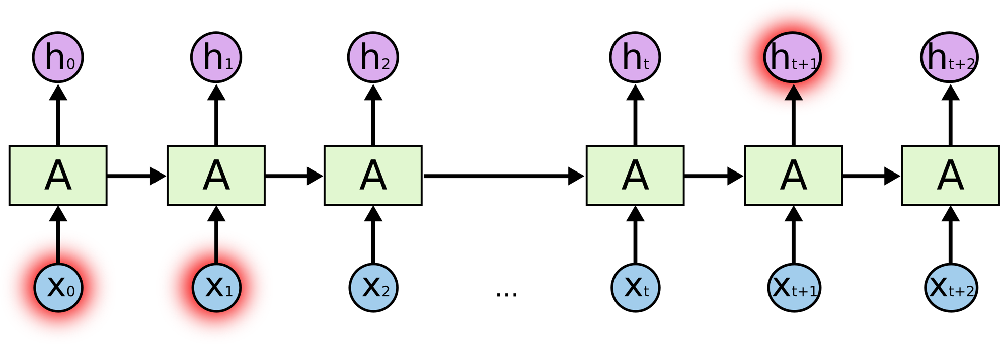

# LSTM 시계열 예측
## Long Short-Term Memory(LSTM)
### 기존 RNN의 구조

- 짧은 기간에 의존하는 RNN

- 긴 기간에 의존하는 RNN
- 필요한 정보를 얻기 위한 시간 격차가 커짐
- 긴 기간의 의존성(long-term dependencies)를 완벽하게 해결하지 못함
### LSTM 정의
- RNN의 특별한 한 종류
- RNN이 긴 의존 기간의 문제를 어려워하는 핵심적인 이유를 찾음
- Hochreiter & Schmidhuber (1997)에 의해 소개
- 긴 의존 기간의 문제를 피하기 위해 명시적으로(explicitly) 설계됨
- 표준 피드포워드 신경망과 달리 피드백 연결이 있음
- 단일 데이터 포인트(이미지 등)뿐만 아니라 전체 데이터 시퀀스(음성 또는 비디오 입력)도 처리 가능
- 긴 의존 기간을 필요로 하는 학습을 수행할 능력을 가짐
- 시계열 또는 시퀀스 데이터를 처리할 때 유용
### LSTM 구조

- RNN과 똑같이 체인과 같은 구조를 가짐
- 각 반복 모듈은 다른 구조를 가짐
- 단순한 RNN 한 층 대신에 4개의 layer가 특별한 방식으로 서로 정보를 주고 받음
   

- LSTM의 반복 모듈에는 4개의 상호작용하는 layer가 존재
   

- 각 선(line) -> 한 노드의 output을 다른 노드의 input으로 vector 전체를 보내는 흐름
- 분홍색 동그라미 -> vector 합과 같은 pointwise operation
- 노란색 박스 -> 학습된 neural network layer
- 합쳐지는 선 -> concatenation
- 갈라지는 선 -> 정보를 복사해서 다른 쪽으로 보내는 fork
  ### LSTM의 핵심 – cell state
  
  - 모듈 그림에서 수평으로 그어진 윗 선
  - 컨베이어 벨트와 같음
  - 작은 linear interaction만을 적용시키면서 전체 체인을 계속 구동
  - 정보가 전혀 바뀌지 않고 그대로 흐르게만 하는 것을 쉽게 할 수 있음
  ### LSTM의 gate 구조
  
  - Cell state에 뭔가를 더하거나 없앨 수 있는 능력
  - 정보가 전달될 수 있는 추가적인 방법
  - Sigmoid layer와 pointwise 곱셈으로 이루어짐
  - LSTM은 3개의 gate를 가지고 있음
  - 각 gate는 cell state를 보호하고 제어함
  - 각 컴포넌트가 얼마나 정보를 전달해야 하는지에 대한 척도
  - Sigmoid layer는 0과 1 사이의 숫자를 내보냄
  ### LSTM의 forget gate layer
  
  - Cell state로부터 어떤 정보를 버릴 것인지 정하는 것
  - Sigmoid layer에 의해 결정됨
  - ht−1과 xt를 받아서 0과 1 사이의 값을 Ct−1에 보냄
  - 값이 1이면 "모든 정보를 보존해라“, 값이 0이면 "죄다 갖다버려라"
  ### LSTM의 input gate layer
  
  - Sigmoid layer가 어떤 값을 업데이트할 지 정함
  - 이전 state인 Ct−1을 업데이트해서 새로은 cell state인 Ct를 만듦
  - 이전 state에 ft를 곱해서 가장 첫 단계에서 잊어버리기로 정했던 것들을 잊음
  - it∗~Ct 를 더함
  - 더하는 값은 두 번째 단계에서 업데이트하기로 한 값을 얼마나 업데이트할 지 정한 만큼 scale한 값
  ### LSTM의 output gate layer
  
  - 무엇을 output으로 내보낼 지 정하는 일
  - Output은 cell state를 바탕으로 필터링된 값이 됨
  - Sigmoid layer에 input 데이터를 태워 cell state의 어느 부분을 output으로 내보낼 지 정함
  - Cell state를 tanh layer에 태워서 -1과 1 사이의 값을 받음
  - 방금 전에 계산한 sigmoid gate의 output과 곱함
  - output으로 보내고자 하는 부분만 보낼 수 있음

## 시계열 (time series)
- 일정 시간 간격으로 배치된 데이터들의 수열
### 시계열 예측 모형

- 이전에 관측된 값을 기반으로 미래의 값을 예측할 수 있는 모형
### 시계열의 예시
- 시간 경과에 따른 온도
- 주가
- 주택 가격
- 입력은 시간에 따라 연속적으로 나타내는 신호(시계열)


## LSTM을 이용한 비트코인 시계열 예측
[비트코인 시계열 데이터 다운](https://www.kaggle.com/datasets/team-ai/bitcoin-price-prediction)

필요 라이브러리
```
Numpy
Matplotlib
Pandas
Sklearn
Keras
Plotly
Seaborn
tensorflow
```

      
      
### Reference
- https://colah.github.io/posts/2015-08-Understanding-LSTMs/
- https://dgkim5360.tistory.com/entry/understanding-long-short-term-memory-lstm-kr
- https://insightcampus.co.kr/2021/11/11/%EC%8B%9C%EA%B3%84%EC%97%B4-%EC%98%88%EC%B8%A1-lstm-%EB%AA%A8%EB%8D%B8%EB%A1%9C-%EC%A3%BC%EA%B0%80-%EC%98%88%EC%B8%A1%ED%95%98%EA%B8%B0/